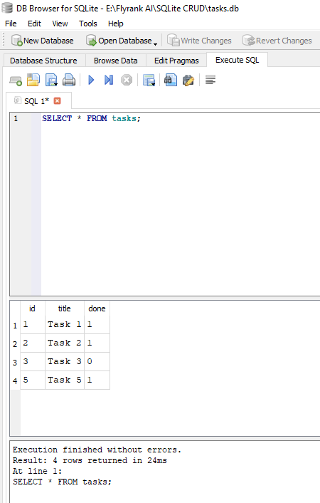

# SQLite CRUD API

A simple REST API built with **Node.js**, **Express.js**, and **SQLite** for performing CRUD (Create, Read, Update, Delete) operations on tasks.

---

## Features

- Create a task
- Get all tasks
- Get a single task
- Update a task
- Delete a task
- SQLite database (no separate database server required)

---

## Tech Stack

- Node.js
- Express.js
- SQLite
- JavaScript

---

# Why SQLite Was Chosen

SQLite was selected because it is lightweight, serverless, and easy to integrate with Node.js. It stores the entire database in a single file, making it ideal for small to medium-sized applications, learning projects, and REST APIs.

### Advantages

- No database server installation
- Zero configuration
- Single database file
- Fast read/write performance
- Portable across operating systems
- Easy backup by copying one file

---

# Database File Location

The SQLite database is stored as a single file inside the project (root folder).

---

# How to Start the Project

## 1. Clone the repository

```bash
git clone https://github.com/your-username/sqlite-crud.git
```


## 2. Install dependencies

```bash
npm install
```

## 3. Start the server

```bash
npm start
```


The server will start on:

```
http://localhost:3000
```

---

# Example SQL Queries Executed

Create table:

```sql
CREATE TABLE tasks (
    id INTEGER PRIMARY KEY AUTOINCREMENT,
    title TEXT NOT NULL,
    done INTEGER
);
```

Retrieve all tasks:

```sql
Select * from tasks;
```

Update a task:

```sql
Update tasks
set title = ?, done = ?
where id = ?;
```

Delete a task:

```sql
Delete from tasks
where id = ?;
```

---

# Database Viewer Screenshot


## Database Viewer




---

